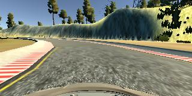
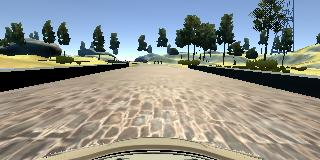
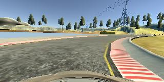
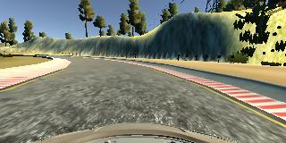
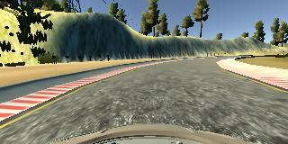
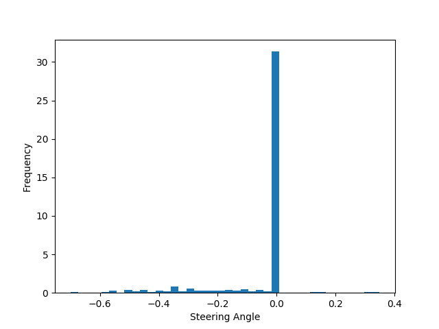
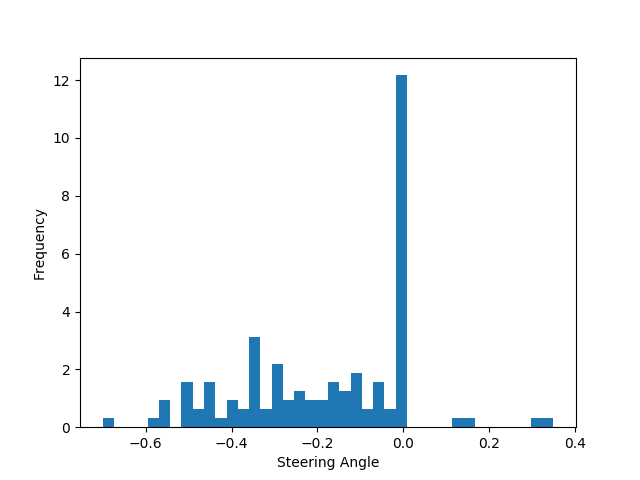
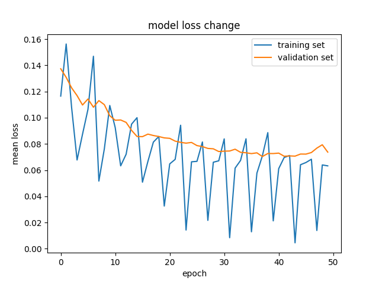

# **Behavioral Cloning** 

---

**Behavioral Cloning Project**

The goals / steps of this project are the following:
* Use the simulator to collect data of good driving behavior
* Build, a convolution neural network in Keras that predicts steering angles from images
* Train and validate the model with a training and validation set
* Test that the model successfully drives around track one without leaving the road
* Summarize the results with a written report


## Rubric Points
### Here I will consider the [rubric points](https://review.udacity.com/#!/rubrics/432/view) individually and describe how I addressed each point in my implementation.

---
### Files Submitted & Code Quality

#### 1. Submission includes all required files and can be used to run the simulator in autonomous mode

My project includes the following files:
* trainingModel.py containing the script to create and train the model
* drive.py for driving the car in autonomous mode
* model.h5 containing a trained convolution neural network
* writeup_report.md or writeup_report.pdf summarizing the results

#### 2. Submission includes functional code
Using the Udacity provided simulator and my drive.py file, the car can be driven autonomously around the track by executing
```sh
python drive.py model.h5
```

#### 3. Submission code is usable and readable

The model.py file contains the code for training and saving the convolution neural network. The file shows the pipeline I used for training and validating the model, and it contains comments to explain how the code works.

### Model Architecture and Training Strategy

#### 1. An appropriate model architecture has been employed

My model consists of a convolution neural network with 3x3 filter sizes and depths between 24 and 64 (model.py lines 80-99)

And one cropping layer is added to remove the redundant area in the image. (code Line 83)

The data is normalized according to the Lambda layer (code line 84)

The model includes RELU layers to introduce nonlinearity , and the data is normalized in the model using a Keras lambda layer (code line 84).


#### 2. Attempts to reduce overfitting in the model

The model contains dropout layers in order to reduce overfitting (model.py lines 90). And the result shows that it would largely help the model to preform better.

The model was trained (80%) and validated (20%) on different data sets to ensure that the model was not overfitting. The model was tested by running it through the simulator and ensuring that the vehicle could stay on the track.


#### 3. Model parameter tuning

The model used an adam optimizer, so the learning rate was not tuned manually (model.py line 116).

The model is created with 50 epochs, so that it gets enough chances to converge. (code line 104).


#### 4. Appropriate training data

Training data was chosen to keep the vehicle driving on the road. I used a combination of center lane driving, recovering from the left and right sides of the road.

For details about how I created the training data, see the next section.

### Model Architecture and Training Strategy

#### 1. Solution Design Approach

The overall strategy for deriving a model architecture was to use CNN.

My first step was to use a convolution neural network model similar to the NVIDIA's self-driving car model. I thought this model might be appropriate because they are created for real cars and tested good.

In order to gauge how well the model was working, I split my image and steering angle data into a training and validation set. I found that my first model had a low mean squared error on the training set but a high mean squared error on the validation set. This implied that the model was overfitting.

To combat the overfitting, I modified the model so that mutiple dropout layers are added. And split the data set into training set and validation set to verify the performance.

The final step was to run the simulator to see how well the car was driving around track one.

At the begining, the vehicle kept turning left, it seems like the model does not understand how to turn right, so I added some flipped images in the data set by 'np.fliplr(image)'. After doing so, the vehicle finally found out how to turn on both sides.
There were a few spots where the vehicle fell off the track, to improve the driving behavior in these cases, I increased the steering angle for the left and riight cameras, and the the vehicle could remain in track all the time.

At the end of the process, the vehicle is able to drive autonomously around the track without leaving the road.

#### 2. Final Model Architecture

The final model architecture (model.py lines 80-99) consisted of a convolution neural network with the following layers and layer sizes:
The model's summary is following(output by Keras):

|Layer (type)                    | Detail                               |
|:------------------------------:|:------------------------------------:|
| cropping2d_1 (Cropping2D)      | cropping=((70, 25), (0, 0))          |
| Normalization (Lambda)         | lambda x: x / 255.0 - 0.5            |
| conv2d_1 (Conv2D)              | Conv2D(24, (5, 5), strides=(2, 2)    |
| conv2d_2 (Conv2D)              | Conv2D(36, (5, 5), strides=(2, 2)    |
| conv2d_3 (Conv2D)              | Conv2D(48, (5, 5), strides=(2, 2)    |
| conv2d_4 (Conv2D)              | Conv2D(64, (3, 3), strides=(2, 2)    |
| flatten_1 (Flatten)            |                                      |
| dropout_1 (Dropout)            | Dropout(0.2)                         |
| dense_1 (Dense)                | Dense(100)                           |
| dropout_2 (Dropout)            | Dropout(0.2)                         |
| dense_2 (Dense)                | Dense(50)                            |
| dropout_3 (Dropout)            | Dropout(0.2)                         |
| dense_3 (Dense)                | Dense(10)                            |
| dropout_4 (Dropout)            | Dropout(0.2)                         |
| dense_4 (Dense)                | Dense(1)                             |


#### 3. Creation of the Training Set & Training Process

To capture good driving behavior, I first recorded one full lap on track one using center lane driving. Here is an example image of center lane driving:

I then recorded the vehicle recovering from the left side and right sides of the road back to center so that the vehicle would learn to move back to the center of the track. These images show what a recovery looks like starting from the border of the track, and then gradually move towards the center:

Left| Center | Right
----|--------|-------
 |  | 

To augment the data sat, I also flipped images and angles thinking that this would ... For example, here is an image that has then been flipped:

Original| Flipped
----|--------
 | 


After the collection process, I had 471 number of data points. I found out tha most of the steering angles in the sample are 0.0, which is shown in the follwoing image:

So i removed 90% of the useless data, and then the dataset looks like:

Full| Processed
----|--------
 | 

And later after I added the flipped data and the left\right camera data into the dataset, I got 4 times of data for both training and validation.

I finally randomly shuffled the data set and put 20% of the data into a validation set.

I used this training data for training the model. The validation set helped determine if the model was over or under fitting. The ideal number of epochs was around 30 as evidenced by the image below shows that the curve reached valley at around epoch 30. I used an adam optimizer so that manually training the learning rate wasn't necessary.

</br>


